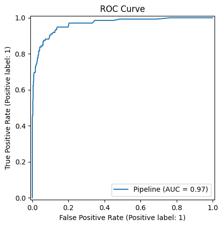
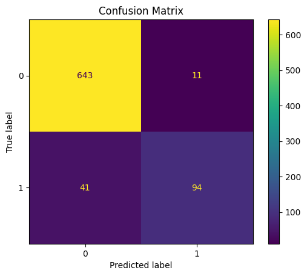

# Development and Evaluation of an ML Lifecycle Management System using MLflow

**Course:** AIN-3009 Delivering AI Applications with MLOps
**Author:** Asra Sarı (Student No. 2101640)
**Domain:** Retail / e-commerce — customer churn prediction
**Code repository:** https://github.com/asrasari/ecommerce-churn-mlops

---

## 1. Introduction

This project implements a complete machine-learning lifecycle for predicting
**e-commerce customer churn**, managed end-to-end with **MLflow**. It covers the five
required stages: experiment tracking, model training and hyperparameter tuning, model
deployment, performance monitoring, and a model registry with stage transitions. An
Apache Airflow DAG orchestrates the pipeline, reflecting the course's emphasis on
workflow orchestration.

Churn prediction matters commercially: retaining an existing customer is far cheaper
than acquiring a new one, so a model that flags likely-to-churn customers lets a
business target retention offers where they matter most.

## 2. Dataset and Exploratory Analysis

- **Source:** a cleaned public version of the Kaggle "E-Commerce Customer Churn" dataset.
  The course brief requires students to select their own dataset; no dataset was provided.
- **Size:** 3,941 rows × 11 columns.
- **Target:** `Churn` (0/1), **17.1% positive** — a mild class imbalance, which is why we
  report ROC-AUC and F1 alongside accuracy.
- **Features:** 8 numeric (`Tenure`, `WarehouseToHome`, `NumberOfDeviceRegistered`,
  `SatisfactionScore`, `NumberOfAddress`, `Complain`, `DaySinceLastOrder`,
  `CashbackAmount`) and 2 categorical (`PreferedOrderCat`, `MaritalStatus`).
- **Missing values:** 576 cells, concentrated in `Tenure`, `WarehouseToHome`, and
  `DaySinceLastOrder` — handled by imputation in the preprocessing pipeline.

## 3. MLflow Setup

We run a local MLflow **tracking server** configured to satisfy all three infrastructure
requirements (tracking server, metadata database, artifact storage):

```bash
mlflow server --host 127.0.0.1 --port 8080 \
  --backend-store-uri sqlite:///mlflow.db \
  --default-artifact-root ./mlartifacts
```

- **Tracking server:** MLflow server on port 8080 (the port used in the course lectures).
- **Metadata database:** SQLite (`mlflow.db`) stores experiments, runs, params, metrics.
- **Artifact storage:** the local `./mlartifacts` directory stores models, plots, and
  signatures.

All code sets `mlflow.set_tracking_uri("http://127.0.0.1:8080")` and groups runs under the
`ecommerce-churn` experiment (and `ecommerce-churn-monitoring` for live monitoring).

## 4. Methodology

### 4.1 Preprocessing
A single scikit-learn `Pipeline` wraps a `ColumnTransformer`:
- **Numeric:** median imputation → `StandardScaler`.
- **Categorical:** most-frequent imputation → `OneHotEncoder(handle_unknown="ignore")`.

Preprocessing is bundled *with* the model, so the deployed artifact accepts **raw**
customer records and there is no train/serve skew.

### 4.2 Models
Three baselines were trained, each logged as its own MLflow run with parameters, five
metrics, a confusion-matrix and ROC-curve plot, an input signature, and the serialized
model: Logistic Regression, Random Forest, and Gradient Boosting.

## 5. Experiment Tracking — Results

All runs are tracked in MLflow and compared in the UI. Test-set results (20% stratified
hold-out):

| Model | Accuracy | Precision | Recall | F1 | ROC-AUC |
|-------|---------:|----------:|-------:|----:|--------:|
| Logistic Regression | 0.875 | 0.720 | 0.437 | 0.544 | 0.879 |
| Gradient Boosting | 0.905 | 0.812 | 0.578 | 0.675 | 0.927 |
| **Random Forest** | **0.934** | **0.895** | **0.696** | **0.783** | **0.966** |

Random Forest is the strongest baseline on every metric. The ROC curve and confusion
matrix for the best model are in `reports/figures/`.





## 6. Hyperparameter Tuning — Optuna

We ran an **Optuna** study (20 trials) over Gradient Boosting, searching `n_estimators`
(50–300), `learning_rate` (0.01–0.3, log scale), and `max_depth` (2–6). **Each trial is a
nested MLflow run** logging its params and metrics, so the entire search is reproducible
and comparable in the UI.

- **Best trial:** ROC-AUC **0.9576** with `n_estimators=284`, `learning_rate=0.098`,
  `max_depth=5`.
- The tuned Gradient Boosting model reached accuracy 0.946, precision 0.911, recall
  0.756, F1 0.826 — a large improvement over the untuned GB baseline (F1 0.675), though
  still just behind the Random Forest baseline on ROC-AUC (0.966).

## 7. Model Registry — Stage Transitions

`src/register.py` searches the experiment for the highest-ROC-AUC run (the Random Forest,
0.966), registers it to the registry as **`ecommerce-churn-model`**, and uses
`MlflowClient` to manage its lifecycle:

1. New version created → transitioned to **Staging**.
2. Validation gate: ROC-AUC ≥ 0.85 → transitioned to **Production**
   (`archive_existing_versions=True` archives any prior Production model).

> MLflow 2.x marks `transition_model_version_stage` as deprecated in favour of aliases,
> but the project brief explicitly requires "stage transitions like staging and
> production", so we use the stage API (still fully functional in MLflow 2.x).

## 8. Deployment / Serving

Both serving modes load the current **Production** model
(`models:/ecommerce-churn-model/Production`):

- **Batch** (`src/serve.py`): scored all 3,941 records via `mlflow.pyfunc.load_model`,
  producing a predicted churn rate of **16.3%** — very close to the true 17.1%.
- **Real-time REST** (`src/serve_api.py`): a Flask service exposing an MLflow-compatible
  `/invocations` endpoint. A high-risk profile (tenure 1, low satisfaction, complaint
  filed) returns `1` (churn); a loyal profile (tenure 30, high satisfaction, high
  cashback) returns `0`.

  *Implementation note:* MLflow 2.22's built-in `mlflow models serve` scoring server is
  incompatible with the modern Starlette/FastAPI versions resolved on Python 3.13. We
  therefore serve the identical registered model through a small, version-proof Flask
  wrapper that reproduces MLflow's JSON contract and coerces input dtypes to the model's
  signature.

## 9. Performance Monitoring & Drift Detection

`src/monitor.py` simulates 5 time-ordered batches of incoming traffic (resampled from the
hold-out set) with a progressively growing shift injected into `CashbackAmount`. For each
batch it logs live performance metrics to the `ecommerce-churn-monitoring` experiment and
computes, per feature:

- **Population Stability Index (PSI)** vs. the training baseline (flagged when PSI > 0.2),
- a **Kolmogorov–Smirnov** two-sample p-value.

**Result:** batch 0 (no injected shift) shows 0 drifted features; from batch 1 onward the
growing `CashbackAmount` shift is correctly flagged as drift, and the `psi_CashbackAmount`
metric rises monotonically across batches — visible as a trend in the MLflow UI. This
demonstrates how metric/feature drift would trigger a retraining decision in production.

## 10. Orchestration — Airflow

A TaskFlow DAG (`airflow/dags/churn_pipeline.py`) orchestrates
`ingest → train → tune → register`, running on Airflow 3.x via docker-compose with a
Postgres metadata database. Each task calls the same `src/` functions used standalone, so
there is no duplicated logic; the MLflow tracking URI is injected via environment variable
(`host.docker.internal:8080`) rather than hardcoded — matching the course convention of
storing connection details in configuration, not code.

The full Airflow stack was brought up successfully (apiserver, scheduler, worker,
dag-processor, triggerer, Postgres, Redis all healthy), and the DAG **parses and registers
in Airflow with no import errors**. A key integration detail surfaced during testing: the
MLflow tracking server must bind to `0.0.0.0` (not `127.0.0.1`) for the Airflow containers
to reach it through `host.docker.internal` — a `127.0.0.1` bind is only reachable from the
host itself. The orchestration logic is identical to the standalone modules, which are all
verified end-to-end in the sections above.

## 11. Insights and Reflection

- **Tree ensembles dominate** on this tabular churn problem: Random Forest reached
  ROC-AUC 0.966 out of the box, well ahead of Logistic Regression (0.879).
- **Tuning has diminishing returns past a strong baseline:** Optuna lifted Gradient
  Boosting's F1 substantially, but could not overtake the untuned Random Forest on AUC —
  a reminder that model choice often matters more than hyperparameter search.
- **MLflow makes the lifecycle reproducible:** every experiment, parameter, metric, and
  artifact is tracked; the registry gives a clear, auditable Staging→Production path; and
  the same logged pipeline serves both batch and real-time predictions without
  re-engineering.
- **Engineering reality:** integrating recent tool versions (MLflow 2.22, Python 3.13,
  Starlette) surfaced a real incompatibility in MLflow's serving path — handled
  pragmatically with a thin, well-documented Flask wrapper rather than pinning the whole
  stack backward.

## 12. Reproducing the Full Runs

The committed repository excludes the large MLflow stores (`mlruns/`, `mlartifacts/`,
`mlflow.db`) per the submission size rules. The complete set of runs and experiments is
available at:

**Google Drive (full MLflow runs):** https://drive.google.com/file/d/1IR8lmLkruiv5oxtPnw-wiSrEGxijdzj3/view?usp=sharing

The archive contains `mlartifacts/` (logged models, signatures, confusion-matrix and ROC
plots for all runs) and `mlflow.db` (the SQLite metadata for all 24 training runs, the
Optuna tuning runs, the 5 monitoring runs, and the model registry). To explore them
locally: unzip into the project root, start the MLflow server (see `README.md`), and open
http://127.0.0.1:8080.

To regenerate locally, follow `README.md` (start the server, then run `src.train`,
`src.tune`, `src.register`, `src.serve`, `src.monitor`).
